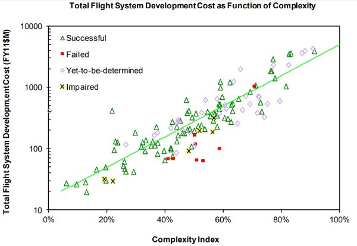

# awesome-spaceflight-software-best-practices

This is the data used for a research project on the history of catastrophic spacecraft failures caused by software faults and best practices associated with software development for spacecraft flight software.

## Contents
- [List of Spacecraft Failures Caused by Software Faults](#list-of-spacecraft-failures-caused-by-software-faults)
- [Crash Investigation Reports](#crash-investigation-reports)
- [Software Safety Standards and Coding Guidelines](#software-safety-standards-and-coding-guidelines)
- [Detailed Recommendations](#detailed-recommendations)
- [Friendly Lists](#friendly-lists)

## List of Spacecraft Failures Caused by Software Faults

| Mission | Year | Description and Proximate Cause |
| :-: | :-: | :-- |
| Mariner 1 | 1962 | Two radar systems guided the Atlas-Agena launch system which launched the Mariner 1 spacecraft. One measured the rocket’s velocity (the Rate System) while the other measured the distance and angle to a tracking antenna at the launch site (the Track System). The two radar systems differed in their timing by 43 ms so the guidance computer which used the data received from the systems to relay control signals back to the spacecraft was programmed with a 43 ms offset. The offset equation required smoothed velocity data from the Rate System, which was represented by an overbar. During transcription of the guidance equations, the overbar was missed and not noticed in the review. The Rate System hardware failed during launch, so guidance control switched to using data from the Track System, but the incorrect equation indicated that the spacecraft velocity was erratically accelerating and decelerating, so correction commands were sent back to the rocket. The rocket was operating nominally, and without these erroneous correction commands would probably have launched successfully. The commands caused the rocket to veer dangerously off course and a range-safety officer triggered the self-destruct command. |
| Gemini 5 | 1965 | Gemini 5 was a generally successful mission, completing many experiments and orbited Earth 120 times - breaking the Soviet record for the duration of a crewed space mission. The landing, however, was 89 nautical miles off course and could have been dangerously so if the navigational error had miscalculated more seriously. The omission of part of a timing calculation (time elapsed from GMT midnight prior to launch) which was used to calculate the position of the spacecraft caused a deviation in the actual longitudinal position from the reported position of 7.89°. The onboard computer then reduced lift to avoid an overshoot, which in actuality resulted in an undershoot of 89 nautical miles. |
| Proton M71 | 1971 | The Proton rocket failed to ignite for its second insertion burn an hour after launch. It was discovered afterwards that the 8-digit software command for the second ignition was entered backwards and thus never activated. As with most Soviet space program failures very little information is available about this anomaly. |
| Phobos 1   | 1988        | A block of unnecessary test code was left in the system’s firmware prior to launch due to the difficulty in removing it and time constraints. The unneeded section of firmware was partitioned from the rest of the software in order to render it inoperative. However, a couple of months after launch a 20-30 page command sequence sent by ground control was missing a single character at the end of the sequence. The test-bed that was normally used to catch errors of this kind was out of commission and the operator decided due to time constraints not to wait for it to become available and issued the commands without them passing any testing. The missing character happened to be pivotal for the command’s interpretation by the spacecraft software and was in fact precisely the code that would access the partitioned test code and cause it to operate. This code issued incorrect GN&C commands to disable the attitude control thrusters which meant that the solar panels were not locked onto the sun and thus the batteries depleted quickly. The spacecraft entered into a tumble and contact was lost. |
| Phobos 2      | 1989       | During a routine imaging session, the Phobos spacecraft disabled its transmitter as planned in order to conserve power. After the imaging session, the probe failed to resume transmission as planned. It is reported that the software failed because a component of the system named ‘e minimal’ was not included in the onboard software - the program was a fault containment component which would put the probe into a safe mode if voltage dropped below a certain level. The component was viewed as unnecessary but would likely have prevented the failure in this case. A voltage drop, perhaps caused by temporary misalignment of the solar panels, is the likely cause of the initial loss of contact. Through emergency commands, the ground team were able to re-establish contact and record 17 minutes of telemetry from the small antenna which indicated that the spacecraft was tumbling but was insufficient to take any further corrective actions before contact was lost permanently. |
| Clementine   | 1994        | A series of software errors escaped detection due to inconsistencies between the operational spacecraft system and the verification tool configurations. The software issued erroneous commands to fire the thrusters which exhausted the fuel supply in 11 minutes and put the spacecraft into an unrecoverable spin. |
| Ariane 5   Flight 501      | 1996       | The Ariane design has multi-level redundancy at the hardware level, with all parts of the Inertial Reference System and main flight control system computer (both hardware and software) duplicated and running in ‘hot’ stand-by mode - i.e. running the same instructions and ready to take over instantaneously. In this case, the redundancy was of no use as both copies of the system contained the same programming error.   An exception occurred when a 64-bit floating-point value was converted into a 16-bit signed integer, which was unable to hold the value in its maximum range. The calculation was actually in a redundant software module that had been left in from the reused Ariane 4 flight software, which allowed it to recalculate launch parameters if a launch was delayed in the final moments, rather than having to delay the launch by a day or more and rerun the entire launch sequence. The code, which ran satisfactorily on the Ariane 4, produced a much higher result and the subsequent error on the Ariane 5 due to higher horizontal velocities in that vehicle compared to the Ariane 4. An operand error occurred, and error logging data was reported by the inertial reference system which the launcher interpreted as flight data and incorporated into flight control calculations. These completely erroneous flight control instructions resulted in large corrective commands for what the launch computer thought were attitude deviations that in fact were spurious. The massive aerodynamic forces on the vehicle caused by this attitude change caused its disintegration.   The major recommendations from the Ariane 5 failure report are:   - Don’t allow software to run if it is not presently necessary.   - Run realistic tests with full system hardware (or as much as is technically feasible).   - Any sensor that encounters a failure should keep sending best effort data.   Additionally, it seems obvious that the critical flight software was not properly partitioned and protected from influence from this module of non-critical code.   The software module perhaps shouldn’t have even been included for the Ariane 4 flight software. It did serve a purpose, but that purpose (saving restart time in the case of a launch delay) may not have justified the additional complexity that adding in this feature created. It is an ever-present reality that non-critical features will always seem to be worth adding at the time, but the negative side of the loss of simplicity, maintainability and re-use is often not fully considered. |
| Mars Pathfinder   | 1997        | Priority inversion resulting in continuous reset of the system by the watchdog timer. The failure resulted in a moderate loss of mission time. |
| Titan IV/MILSTAR      | 1999       | A MILSTAR (Military Strategic and Tactical Relay) satellite launched atop a Titan IV rocket and a Centaur upper stage in April 1999. The failure was caused by a mistyped constant value - for the roll rate filter in the inertial measurement system file. The value was entered as -0.1992476 instead of -1.992476 (an order of magnitude lower due to the decimal point being misplaced). The value resulted in erroneous calculation of the roll rate data and caused the loss of roll axis control. The reaction control system attempted to correct the attitude but quickly exhausted its fuel supply. The launch failure meant that the satellite was placed in an unstable orbit that was far too low (it was intended for geosynchronous orbit) to provide the services it was designed for and was permanently shut down after 10 days.   The initial transcription mistake, and then a one-time review that failed to spot the error, resulted in this value becoming the truth baseline for the entire remaining design and launch process. This shows the risk of placing too much emphasis on one-time or early checks of critical software, and the need to implement staged reviews during the entire development and integration process which check the entire toolchain, rather than just recent changes. |
| Mars Climate   Orbiter (MCO)   | 1999        | A ground software file called ‘SM_FORCES’ (Small Forces) which was used in trajectory calculations that were sent to the spacecraft used imperial units rather than the metric units (lb-sec instead of Newton-sec) used in the rest of the software, including the ‘AMD’ (Angular Momentum Desaturation) file that it sent data to. The AMD file was used during the 9-month trip to Mars for propulsion maneuvers to remove angular momentum buildups in the craft’s reaction wheels. The AMD corrections, being calculated using partially incorrect units, resulted in an increasingly inaccurate trajectory model over the course of the journey. The final insertion at Mars was approximately 170 km lower in altitude than expected and was far lower than the survivable altitude for the EDL phase to handle.   In a bit more detail about the specifics of how the units were misinterpreted - the files used in the trajectory calculations for the MCO had the 4.45 pounds-Newtons conversion factor buried in the equation, with no obvious identification or comments. The new software development team missed the fact that the equations had included this conversion factor and replaced it with the new equation for the MCO without adding any accommodation for the conversion. |
| Mars Polar   Lander (MPL)      | 1999       | Despite extensive recommendations from the MCO crash investigation, designed to avoid a software fault causing the subsequent loss of the already flying MPL mission, a different software error resulted in its destruction during the landing sequence in January 2000, 4 months after the MPL loss. The cause could not be confirmed due to a lack of communication during the landing (and the accompanying telemetry), but the most likely cause was identified as premature shutdown of the descent engines caused by a misinterpreted touchdown indication from vibrations of the landing legs. Engine shutdown would have occurred at 40m altitude in this scenario, at a velocity of 13 m/s, increasing to 22 m/s at the surface (due to gravitational acceleration). Thus the touchdown likely occurred at around 10 times the nominal design speed and was not survivable. The system did have an accommodation for these spurious signals, requiring persistence for two consecutive sensor readings, but later testing (after the crash) showed that most scenarios of the parachute deployment, atmospheric turbulence and landing leg deployment vibrations would fulfil this test and thus result in erroneous landing detection.   The investigation revealed that some parts of the code, including the critical section involved in the fault, was worked on by a single developer. They recommended that all code modules be worked on at least by a team of developers. Another important detail revealed by the investigation was the fact that integration tests combining the flight system, propulsion systems and thermal control were not fully completed, and may have picked up on the error.   Another finding was that the touchdown logic was flawed in the sense that it allowed for engine shutdown already at an altitude of 40 metres when radar sensing was disabled, and probably should have been delayed and enabled based on other input. |
| Zenit 3SL   | 2000        | On March 12, 2000 a Zenit-3SL was to launch the ICO F-1 communications satellite into orbit for Sea Launch’s ocean-based launch platform. The ground software which was sending launch sequence instructions to the launch vehicle was missing a command for closure of a pneumatic valve on the second stage prior to launch. This unclosed valve culminated in a loss of helium from the pressurisation tank on the second stage and the inability of the vehicle to reach orbital velocity. |
| Spirit rover      | 2004       | A design error in the file system services module from the COTS (Commercial off-the-shelf) software resulted in a large amount of memory being used to represent the file system structure (containing all files ever created), including deleted files. When the flash memory filled up the rover was unable to operate until careful corrective actions were taken by the ground team over a 2-week period. The failure resulted in a moderate loss of mission time. |
| CryoSat-1   | 2005        | ESA’s CryoSat-1 launched on a Rokot/Briz-KM rocket combination in October 2005. The flight software was missing a command for the second stage engine cutoff, and it continued burning until depleting all of its fuel and prevented the upper stage from separating. The second and upper stages thus remained connected, along with the CryoSat satellite and descended into the ocean. |
| Mars Global   Surveyor (MGS)      | 2006       | The Mars Global Surveyor (MGS) operated for almost 10 years, including over 8 additional years after the primary mission was completed. Contact was lost in November 2006 just after the 4th mission extension. In June 2006, five months before the loss of contact, an update to the contingency positioning instructions for the spacecraft’s High Gain Antenna was written to an incorrect memory address. This error eventually caused both the overheating of one of the onboard batteries as it was overexposed to the sun and unfortunately also precluded any corrective actions as it caused the spacecraft to miscalculate its orientation to Earth and was therefore unable to communicate with NASA through the Deep Space Network. This fact - that the fault caused both a catastrophic fault and also made communication (and corrective action) impossible, makes the MGS case an important example of safe coding principles. Another relevant note from this scenario is the fact that the erroneous update itself was part of an effort at correcting a previously introduced operator input error in an update that was sent to the spacecraft in September 2005.   Key Lessons from MGS:   - Erroneous updates 14 months before the loss of contact, and then corrective updates 5 months before loss of contact (which were also erroneous) finally manifested themselves in November 2006.   - Erroneous memory write caused both failure in spacecraft hardware, and caused incorrect alignment and therefore stopped any ability to communicate with, and correct, the original hardware fault.    - Efforts to correct a minor error ended up introducing another error which proved to be much more serious. It must be remembered that if not done carefully, corrective actions can cause even worse problems than what they are trying to correct. |
| Ekspress-AM4   | 2011        | The Ekspress-AM4 satellite launched atop a Proton rocket and Briz-M upper stage on August 18, 2011. An incorrect entry in the flight software which set the time allowed for the delta rotation prior to the third burn of the upper stage resulted in the pitch axis gimbal ring in the gyroscopic system hitting a hard stop at its gimbal limit. The rocket was then unable to correctly maneuver into its target orbit. |
| Deep Impact Probe      | 2013       | The Deep Impact Probe successfully completed its mission to study the comet Tempel 1 using an impactor to eject debris and study the composition of the comet. During its extended mission, the spacecraft began to continuously reset itself on August 13, 2013. Mission control tried to address the issue but they were unable before the spacecraft lost its orientation - both making communication impossible and depleting the solar-powered batteries. The error was introduced into the code when the clock counter on the spacecraft overflowed the range of the 32-bit integer holding the timing variable. The system used a starting date (epoch) of January 1, 2000 at 00:00:00. The timer counted time using 100 ms increments from the starting epoch, resulting in the clock counter ticking over the limit (232 or 4,294,967,296) of the 32-bit integer holding its value 13.6 years after that starting epoch - i.e. August 13, 2013. The system was trying to enter safe mode by resetting everything, but this fault containment strategy did not involve resetting the system clock, which continues counting even during fault detection and recovery. |
| Hitomi (ASTRO-H)   | 2016        | The Hitomi gyroscope-based inertial reference system was misreporting a rotation of 21.7° around its Z-axis after a pointing maneuver, and the star tracker would normally be available to confirm this (and would have correctly reported a stable orientation). However, a bias value for the star tracker which set the minimum brightness required for it to lock onto stars to determine location and attitude was set too high and it was not able to be used. This decision was designed to make the attitude calculations quicker and maximise observation time. The situation was reported to ground control and corrective maneuvers were implemented and uploaded to the spacecraft, but an operator error uploaded previously meant that the rotation calculations were not correct. Specifically, negative position values must be converted to positive before input into a calculation tool, but this was missed by the operator in their first time carrying out the procedure. The uploaded instructions then caused the thrusters to further increase in the anomalous rotation speed. The series of errors culminated in the breakup of the spacecraft due to the excessive centrifugal forces. |
| Exomars Schiaparelli      | 2016       | After the parachutes were deployed, the inertial measurement unit reported a larger than expected Z-axis pitch and a saturation flag was raised. The turbulence caused by the parachute deployment was the cause of the temporarily higher Z-axis pitch. The GN&C software continued to use this saturated threshold limit in its calculations when the craft was actually oscillating, as the flag was not designed to correct itself after saturation during the EDL phase. The continued integration of this erroneous threshold value caused the attitude estimate of the craft to deviate by ~165° on the Z-axis (i.e. almost upside down). This incorrect orientation estimate caused the system to calculate a faulty altitude, negative altitude in fact, which had no plausibility check in the software logic. The completely incorrect parameters further propagated through the landing logic and resulted in the landing thrusters being turned off almost immediately after beginning to fire - running for only 3 seconds instead of 30 seconds. The craft was still at an altitude of 3.7km, and free fell to the surface impacting at around 150 m/s and was destroyed.   Important lessons from the Schiaparelli loss are:   - The persistence flag setting was not properly verified during integration and was believed to be 15ms - the craft would probably have landed successfully if the flag did, in fact, persist for only 15ms before taking new measurements again.   - Flawed logic in the GN&C system which continued to integrate the faulty attitude measurements and accumulated an attitude determination almost upside down, which was not plausible given the radar echoes were still being received from the Martian surface during the entire EDL phase.   - Inputs should always be checked for plausibility. Both the attitude (upside down) and the altitude (negative altitude - i.e. below the surface) were not plausible values yet were incorporated into the EDL sequence. Another implausible yet untested part of the landing sequence was the fact that the altitude changed from 3.7km to a negative value, in under 1 second. |
| Soyuz-2.1b   | 2017        | A Soyuz-2.1b with a Fregat-M upper stage launched with 19 satellites on 28 November 2017. Roscosmos confirmed after a lengthy investigation that the coordinates of the Baikonur Cosmodrome in Kazakhstan had been hardcoded into the launch software for the Fregat upper stage. The launch algorithm operated successfully until a new launch location was opened in Russia (the Vostochny Cosmodrome). The current programmers were unaware of this unidentified reference to the Baikonur coordinates in the flight software and it was never updated or removed. The mistake led to the rocket still attempting to correct its orientation based on false coordinates while the main engine ignited for a preprogrammed burn. The incorrect orientation led to a trajectory which ended in the Atlantic ocean. |
| Beresheet      | 2019       | On 11 April 2019 Israel attempted its first moon landing with the Beresheet lander. One of the inertial measurement units reported an error, and during attempts to restart the unit the entire system reset and the main thruster was shut down early and an altitude of around 150 m. This led to a hard landing and loss of the spacecraft. |
| Boeing Starliner   | 2020        | Boeing’s first orbital test flight of their planned future manned crew capsule was unsuccessful and had to cancel its planned rendezvous and docking with the space station due to a software fault. The spacecraft also suffered issues during the landing phase due to additional software defects. The first coding error concerned the Mission Elapsed Timer (MET) of the starliner, which was incorrectly set to an earlier starting time (17 hours before launch) rather than the terminal count of the Atlas V launch vehicle. Thus the timing of the spacecraft clock was incorrect and flight maneuvers were not conducted at the correct time and too much fuel was exhausted trying to recover to a stable orbit. The rendezvous and docking with the space station had to be cancelled.   After the MET anomaly, Boeing and NASA teams conducted a full review of the flight software and discovered another error which also could have caused a catastrophic loss of the vehicle during the return to Earth. A list of 61 recommendations were presented by NASA for Boeing to implement before a repeat of the unmanned orbital test flight can occur. |

## Crash Investigation Reports

[An Analysis of Causation in Aerospace Accidents](./PDF/Crash_Reports/An_Analysis_of_Causation_in_Aerospace_Accidents.pdf)

[Anomaly Trends for Robotic Missions to Mars](./PDF/Crash_Reports/Anomaly_Trends_for_Robotic_Missions_to_Mars.pdf)

[Ariane Flight 501 Report to the Inquiry Board](./PDF/Crash_Reports/Ariane_Flight_501_Report_to_the_Inquiry_Board.pdf)

[ESA EXOMARS 2016 Schiaparelli Anomaly Inquiry](./PDF/Crash_Reports/ESA_EXOMARS_2016_Schiaparelli_Anomaly_Inquiry.pdf)

[Evaluating Accident Models Using Recent Aerospace Accidents](./PDF/Crash_Reports/Evaluating_Accident_Models_Using_Recent_Aerospace_Accidents.pdf)

[Mars Climate Orbiter Mishap Investigation Board Phase I Report](./PDF/Crash_Reports/Mars_Climate_Orbiter_Mishap_Investigation_Board_Phase_I_Report.pdf)

[Mars Global Surveyor Spacecraft Loss of Contact](./PDF/Crash_Reports/Mars_Global_Surveyor_Spacecraft_Loss_of_Contact.pdf)

[Phobos at Mars](./PDF/Crash_Reports/Phobos_at_Mars.pdf)

[Report on the Loss of the Mars Polar Lander and Deep Space 2 Missions](./PDF/Crash_Reports/Report_on_the_Loss_of_the_Mars_Polar_Lander_and_Deep_Space_2_Missions.pdf)

[Sea Launch - Summary of Investigation and Return-to-Flight Preparations](./PDF/Crash_Reports/Sea_Launch_-_Summary_of_Investigation_and_Return-to-Flight_Preparations.pdf)

[The Failures of the Mars Climate Orbiter and Mars Polar Lander - A Perspective from the People Involved](./PDF/Crash_Reports/The_Failures_of_the_Mars_Climate_Orbiter_and_Mars_Polar_Lander_-_A_Perspective_from_the_People_Involved.pdf)

[The Role of Software in Spacecraft Accidents](./PDF/Crash_Reports/The_Role_of_Software_in_Spacecraft_Accidents.pdf)

[What Really Happened on Mars](./PDF/Crash_Reports/What_Really_Happened_on_Mars.pdf)

## Software Safety Standards and Coding Guidelines

### Key Coding Standards/Guidelines
| Standard/Guideline | Year | Language(s) |
| :-- | :-: | :-: |
| DO-178B | 1992 | General |
| NASA C | 1994 | C |
| MISRA C:1998 | 1998 | C |
| ESA C and C++ | 2000 | C/C++ |
| MISRA C:2004 | 2004 | C |
| NASA Software Safety Guidebook | 2004 | All (incl. C/C++) |
| JSF (Joint Strike Fighter) C++ | 2005 | C++ |
| NASA C++ | 2005 | C++ |
| Power of Ten | 2006 | C |
| MISRA C++ | 2008 | C++ |
| JPL C | 2009 | C |
| DO-178C | 2011 | General |
| MISRA C:2012 | 2012 | C |
| BARR C | 2018 | C |

[Embedded_C_(ISO-IEC_TR_18037)](./PDF/Coding_Standards/Embedded_C_(ISO-IEC_TR_18037).pdf)

[JSF++_(Joint_Strike_Fighter)_C++_Coding_Standard](./PDF/Coding_Standards/JSF++_(Joint_Strike_Fighter)_C++_Coding_Standard.pdf)

[NASA_Software_Safety_Guidebook_(GB-8719.13)](./PDF/Coding_Standards/NASA_Software_Safety_Guidebook_(GB-8719.13).pdf)

[NASA_Software_Safety_Standard_(STD-8719.13B)](./PDF/Coding_Standards/NASA_Software_Safety_Standard_(STD-8719.13B).pdf)

[NASA_C++_Coding_Standard_and_Style_Guide](./PDF/Coding_Standards/NASA_C++_Coding_Standard_and_Style_Guide.pdf)

[ESA_Software_Safety_Guidebook_(ECSS-E-HB-40A)](./PDF/Coding_Standards/ESA_Software_Safety_Guidebook_(ECSS-E-HB-40A).pdf)

[ESA_Software_Engineering_Standards_(PSS-05-01)](./PDF/Coding_Standards/ESA_Software_Engineering_Standards_(PSS-05-01).pdf)

[ESA_C_and_C++_Coding_Standards](./PDF/Coding_Standards/ESA_C_and_C++_Coding_Standards.pdf)

[ESA_Software_Dependability_and_Safety_(ECSS-Q-HB-80-03)](./PDF/Coding_Standards/ESA_Software_Dependability_and_Safety_(ECSS-Q-HB-80-03).pdf)

[ESA_Space_Engineering_Software_(CSS-E-ST-40C)](./PDF/Coding_Standards/ESA_Space_Engineering_Software_(CSS-E-ST-40C).pdf)

[ESA_Testing_(ECSS-E-ST-10-03C)](./PDF/Coding_Standards/ESA_Testing_(ECSS-E-ST-10-03C).pdf)

[ESA_Risk_Management_(ECSS-M-ST-80C)](./PDF/Coding_Standards/ESA_Risk_Management_(ECSS-M-ST-80C).pdf)

[ESA_Technology_Readiness_Levels](./PDF/Coding_Standards/ESA_Technology_Readiness_Levels.pdf)

[ESA_Electrical_Electronic_and_Electromechanical_Components_(ECSS_Q_ST_60C)](./PDF/Coding_Standards/ESA_Electrical_Electronic_and_Electromechanical_Components_(ECSS_Q_ST_60C).pdf)

[ESA_Calculation_of_Radiation_and_its_Effects_(ECSS-E-HB-10-12A)](./PDF/Coding_Standards/ESA_Calculation_of_Radiation_and_its_Effects_(ECSS-E-HB-10-12A).pdf)

[ESA_Radiation_Hardness_Assurance_(ECSS Q_ST_60_15C)](./PDF/Coding_Standards/ESA_Radiation_Hardness_Assurance_(ECSS_Q_ST_60_15C).pdf)

  
Important rules or guidelines that are common to most of the standards include:
- **Document and justify deviations from the standard:** this expectation was established early on in DO-178B, MISRA C:1998 and the ESA C and C++ coding standard, and has carried through to be included in most of the standards since. 
- **Use modern, safer language features rather than their older, less safe counterparts:** C++ casts rather than C-style casts, C++ smart pointers rather than <code>new</code> /<code>delete</code> or C-style pointers
- **Include default/fall-through clauses for all <code>switch,</code> <code>if...else</code> statements:** <code>default</code> for all <code>switch</code> statements, a final <code>else</code> for all <code>if...else</code> statements, a final <code>catch</code> for any unhandled exceptions
- **Include default handlers for exceptions:** use function <code>set_unexpected()</code> and function <code>set_terminate()</code> for handling errant exceptions
- **Functions should have a single point of exit:** as per the overarching industry standard (IEC 61508) 
- **Qualify as <code>const</code> any variables that are not modified:** i.e. utilise <code>const</code> to increase compile time error-detection
- **Use simple control flow (avoid recursion, avoid use of statements like <code>goto</code> and <code>continue</code>):** recursion and jumping logic make program flow harder to reason about, especially for future programmers maintaining the software
- **Avoid dynamic memory allocation/deallocation after initialisation:** most memory allocators/deallocators (e.g. <code>malloc</code>, <code>free</code>) have non-deterministic behaviour, and not allocating all memory at initialisation means that a large class of errors become possible such as forgetting to free memory, over-utilisation of memory etc.
<code>typedef</code> the basic numerical types: allows the signedness and size of the main types to be immediately clear in the code, rather than relying on implementation-specific assumptions
- **Objects should be declared at the most limited scope possible:** the more limited the scope and lifetime of an object, the lower the chances that it can be improperly accessed
- **Be explicit rather than implicit:** examples include implicit conversion to <code>bool</code> in an <code>if</code> statement, using brackets to control the order of operations
- **Use unambiguous typography:** Identifiers should differ by only a mixture of case, the letter <code>‘O’</code> and the number <code>‘0’</code>, <code>‘l’</code> and <code>‘1’</code>, <code>‘i’</code> and <code>‘l’</code>, <code>‘S’</code> and <code>‘5’</code>, <code>‘Z’</code> and <code>‘2’</code>, <code>‘n’</code> and <code>‘h’</code>, <code>‘B’</code> and <code>‘8’</code> or other easily misidentified characters.

A selection of noteworthy guideline-specific rules are included below:
- **ESA C and C++** advised that programmers should optimise for clear, maintainable code as a first preference; only optimising for speed, memory usage or compactness when absolutely necessary (Rule 7). ESA also has a very strict subset for use onboard spacecraft which bans the use of exceptions, templates, namespaces, multiple or virtual inheritance and dynamic memory allocation (Rule 124).
- **MISRA C++: 2008** allows the use of <code>goto</code> in limited circumstances (only for forward jumps, not back, and only in the same function body).
- **JPL (Jet Propulsion Laboratory) C** states as its goals: Reliability, Portability (i.e. not compiler or linker dependent), Maintainability (code should be consistent, readable, simple in design, and easy to debug), Testability (by minimising the following in each code module: code size, complexity, static path count (number of paths through a piece of code), Reusability, Extensibility, Readability.
- **BARR-C: 2018** takes a much more serious view of style, considering it a major component of successful error prevention. The standard lists almost 70 style-related guidelines, in sharp contrast to almost all other safety-critical and space-related software standards which leave stylistic concerns squarely in the domain of organization and team preference.

## Detailed Recommendations
These recommendations are not focused on minor variations in grammar/formatting - the likes of which inspire voluminous and never-ending debates between programmers. Nor are they focused on generally applicable principles such as maintaining architectural integrity and adopting well-worn design patterns. The focus is instead on issues that are directly related to space-related software safety, and that can clearly be linked with safety implications in operational code.

Techniques to deal with software faults can broadly be categorised into three primary areas: prevention, detection, and containment; as further defined by Dvorak (2009):
>“Prevention includes strong requirements capture and analysis, architectural principles, model-based engineering, coding standards, and codestructuring rules. Detection includes not only traditional testing but also compliance checkers, static source code analyzers, logic model checking, and test randomization techniques. Containment includes hierarchical backup methods, memory protection techniques, and broad use of software safety margins.”

Each area is important and needs to receive due consideration during design and construction of the software system. Prevention of faults has obvious benefits, rapid and accurate detection may be the difference between having time to save a mission or not, and effective containment can help to reduce the impact of faults and keep the other subsystems running smoothly.

Some of the below recommendations are time or cost-intensive and are in direct or partial conflict with other considerations. In general, making a system safer (for humans) can reduce its reliability (ability to achieve its tasks) or performance. On the other hand, making a system more complex or encompassing more functionality can make it less safe. Adequate risk management requires weighing these competing interests against cost and schedule considerations and designing a compromise suitable for the scale of the mission and the operational environment (ECSS 2008). If good design has put a system at the pareto-optimal frontier of safety, given the cost and schedule constraints, safety can only be further improved by impairing another parameter such as cost, speed, flexibility etc. (Dvorak 2009).

At the same time, a holistic view of system safety and fault management will improve overall safety. The only way to increase safety in some circumstances may be to situate it in a different area of control (software/hardware/operator/procedural). An example is provided below in figure 3 from NASA’s Software Safety Guidebook.

| Cause | Control | Example |
| :-: | :-: | :-: |
| Hardware | Hardware | Pressure vessel with pressure relief valve. |
| Hardware | Software | Fault detection and safing function; or arm/fire checks which activate or prevent hazardous conditions. |
| Hardware | Operator | Operator opens switch to remove power from failed unit. |
| Software | Hardware | Hardwired timer or discrete hardware logic to screen invalid commands or data. Sensor directly triggering a safety switch to override a software control system. Hard stops for a robotic arm. |
| Software | Software | Two independent processors, one checking the other and intervening if a fault is detected. Emulating expected performance and detecting deviations. |
| Software | Operator | Operator sees control parameter violation on display and terminates process. |
| Operator | Hardware | Three electrical switches in series in a firing circuit to tolerate two operator errors. |
| Operator | Software | Software validation of operator-initiated hazardous command. Software prevents operation in unsafe mode. |
| Operator | Operator | Two crew members, one commanding and the other monitoring. |

**Language Choice**
In early space missions, computer instructions were coded by hand in assembly. As the industry developed in the 60s, 70s and 80s programming was done in the higher-level languages of Fortran and ADA, which were still considered highly safe. As the other technical industries gained prominence and drew the most talented engineers, the languages used in those industries, including C and C++, became the default for safety-critical implementations, thanks to their increased functionality and large pool of qualified engineers (Leveson 2013). In the present day, finding enough engineers experienced in Fortran or ADA (let alone assembly) would likely be impossible for a new project, and probably not desirable given the level of safety possible with subsets of C and C++ (Rierson 2017).

The other major consideration relevant during language choice is the level of tool support in the specific mission domain, taking into account the relevant hardware.

C has proven the most suitable option in many spacecraft software engineering scenarios, given its ability to closely manipulate the underlying hardware, support for some higher-level concepts, and wide tool support (Bagnara et al. 2018). Nevertheless, these strengths come with several contingent weaknesses:
- Wide tool support has essentially led to the creation of countless ‘dialects’ of C, where each compiler, each with hundreds of optimisation and other options that can be enabled or disabled, outputs different object code at the end of the build process
- The ‘trust the programmer’ approach adopted by the C Standard allows almost anything to be done with the language - including highly unsafe actions that most often lead to faults

C++ has seen a faster pace of innovation and introduction of new features with major updates in 1998, 2003 and 2011. The popularity of C++ in many other industries, including gaming and robotics, is mainly thanks to its speed and wide feature-set. Younger aerospace companies like SpaceX or Rocket Lab use C++ for flight software to take advantage of the large number of qualified engineers, and perhaps also due to their higher level of risk tolerance (SpaceX 2020, RocketLab 2020).

**Use a Coding Standard**
The IEEE Institute of Electrical and Electronics Engineers) and the IEC (International Electrotechnical Commission) are the two main standards bodies responsible for publishing software safety standards. These standards cover the full software lifecycle and focus more on documentation and process requirements (Lawrence 1995), which is not the primary focus of this paper. Coding standards have been covered above, and are an important safety element of any project. While each company or institution will have their own preferences and internal guidelines, it is important that a defined set of standards exists. Project standards should be:
- **Minimal:** don’t add unnecessary, pedantic or confusing guidelines that will be hard for programmers to understand and comply with.
- **Established:** using a common, established, fixed guideline (e.g. MISRA, Power of Ten etc.) will increase the proportion of people interacting with the code that will be familiar with the rule set. Also, using an unmodified (or as minimally modified as possible) rule set allows easy machine-checkable analysis by the established tools in the market - changing rules to fit a project may seem valuable at the time, but it may then be time consuming, and often impossible, to perfectly configure static analysis tools for automated checking of compliance with the modified standard.

The coding standard chosen will define the subset of the language that is considered safe for the intended use. Each standard defines its language subset to remove the most error-prone and ambiguous or non-deterministic features of a language. Once a language, coding standard and toolchain are chosen for a project, it must remain fixed to allow unambiguous verification.

The list of recommended coding rules, in the previous section, will most likely be present in the coding standard chosen, and in general they provide a solid foundation on which to customise the project-specific coding guidelines.

**Avoiding Complexity**
The single most influential factor in avoiding downstream software faults is avoiding complexity. Minimising the complexity of a system, wherever possible, is the highest leverage activity that can be applied early in a development process. A simpler design for a software module can reduce the number of logical paths through the code, and the number of potential faults, by an order of magnitude or more.

NASA recognised the worrying trend of increasing size and complexity in flight software, and commissioned a large-scale study of the issue in 2007 which was published in 2009. The definition of complexity used in the study was chosen to be intuitive and practical: “how hard something is to understand or verify” (Dvorak 2009). Another, more specific definition, is referenced as well which is that complexity represents the number of variables and their interdependencies - with more of either increasing the overall complexity (Dorner 1997). Moving to an even more specific definition of complexity as it applies to software, the UK Ministry of Defence classifies a system as complex “if its design is unsuitable for the application of exhaustive simulation and test, and therefore its behavior cannot be verified by exhaustive testing” (UK MOD 1999). Dvorak, author of the NASA study, notes that software has become the ‘complexity sponge’ of modern spacecraft, as a seemingly never-ending stream of new features and capabilities are expected to be implemented by new systems. Other trends that have led to growing complexity include increasing autonomy, longer missions (and multiple pre-planned mission extensions) and higher expectations of fault protection code to maintain system operations rather than simply entering a safe mode (Reinholtz in Dvorak 2009).

The level of complexity of the mission itself, as well as the hardware and software of the spacecraft, plays an outsized role in the eventual success of a mission. To put it quite simply - the more complex the mission, the higher the chances of failure or an impairment. This fact seems like common sense but is apparently regularly forgotten as missions become ever-more complex while development and integration costs are expected to remain ‘lean’. In figure 2 below, the inevitability of increasing development cost is obvious as mission complexity increases. This study (Bearden et al. 2012) assessed factors like number of payloads, design life, data recording/uplink/downlink requirements, redundancy requirements etc. to measure overall complexity of the flight systems in each mission. Another clear message from the study is the fact that trying to cut corners or institute a ‘better, faster, cheaper’ approach will increase the chances of mission failure or impairment - almost all of the failures/impairments in the study were developed significantly below the average cost for missions of similar complexity.

## Friendly Lists

